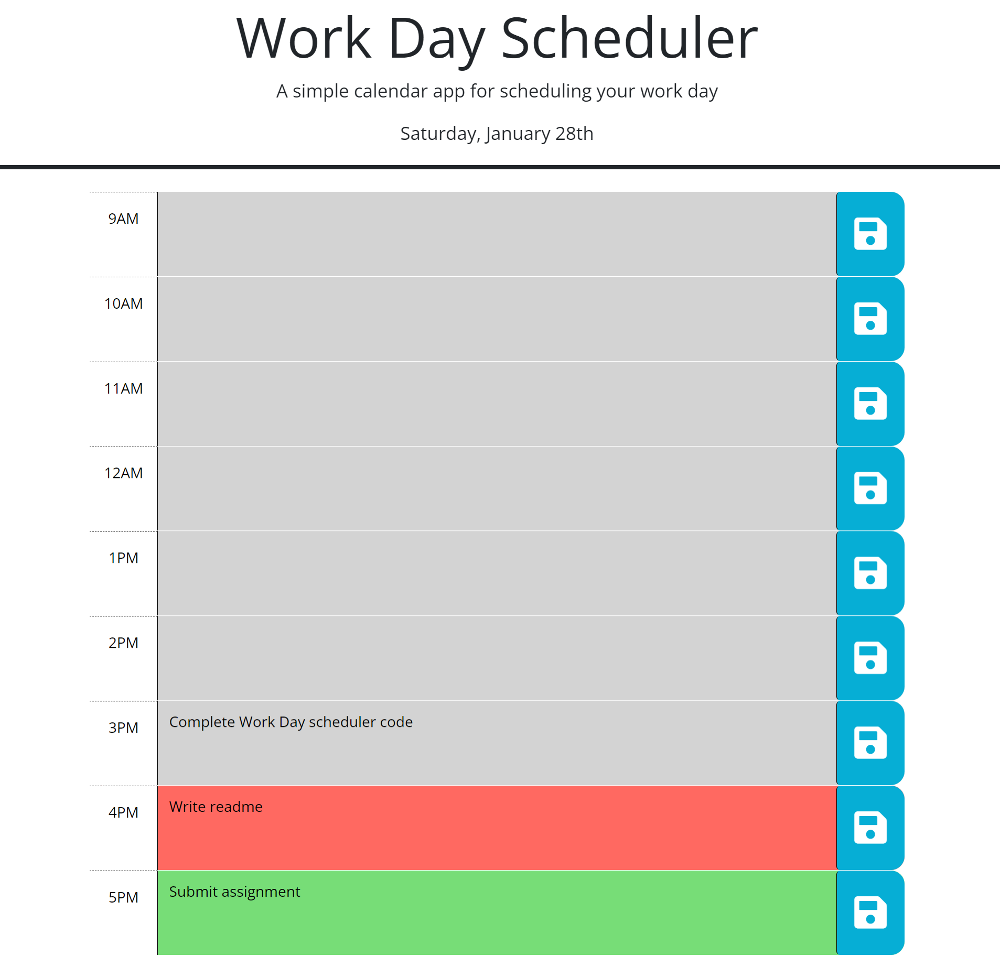

# Simple Work Day Schadular

## Description

The goal of this project is to build a simple work day scheduler application that has a function to add important evenents daily and save to local storage based on a user story provided on UW bootcamp Module 5 chalenge. Full content of user story and acceptance criteria is listed under github issue#1 of this repasatory.This application will have a header which contains name of the aplication and display current day. It also containes text area along with save button on the right for each hour from 3AM to 5PM. 

## Usage
When application is loaded  , it will display current date on the header. Each hours from 3am to 5pm will have text area to enter events along with save button on the right side. Text aras for past, present and feature hours will have background of gray , red and green respectively. Once event is interd on text area and a save icon clicked then , event will be saved in local storage. Every time page refreshed or loded events corosponding to each time block text area will be displayed.

Here is the link to published page https://getnetgit.github.io/Simple-Work-Day-Scheduler/ .

 

Simple Work Day Scheduler screenshot

## Credits
I used resorces in UW bootcamp modules and [https://developer.mozilla.org/en-US/], [https://www.w3schools.com/] was also helpful to do some research for this project. 

## License

MIT License

Copyright (c) 2023 GET

Permission is hereby granted, free of charge, to any person obtaining a copy
of this software and associated documentation files (the "Software"), to deal
in the Software without restriction, including without limitation the rights
to use, copy, modify, merge, publish, distribute, sublicense, and/or sell
copies of the Software, and to permit persons to whom the Software is
furnished to do so, subject to the following conditions:

The above copyright notice and this permission notice shall be included in all
copies or substantial portions of the Software.

THE SOFTWARE IS PROVIDED "AS IS", WITHOUT WARRANTY OF ANY KIND, EXPRESS OR
IMPLIED, INCLUDING BUT NOT LIMITED TO THE WARRANTIES OF MERCHANTABILITY,
FITNESS FOR A PARTICULAR PURPOSE AND NONINFRINGEMENT. IN NO EVENT SHALL THE
AUTHORS OR COPYRIGHT HOLDERS BE LIABLE FOR ANY CLAIM, DAMAGES OR OTHER
LIABILITY, WHETHER IN AN ACTION OF CONTRACT, TORT OR OTHERWISE, ARISING FROM,
OUT OF OR IN CONNECTION WITH THE SOFTWARE OR THE USE OR OTHER DEALINGS IN THE
SOFTWARE.
